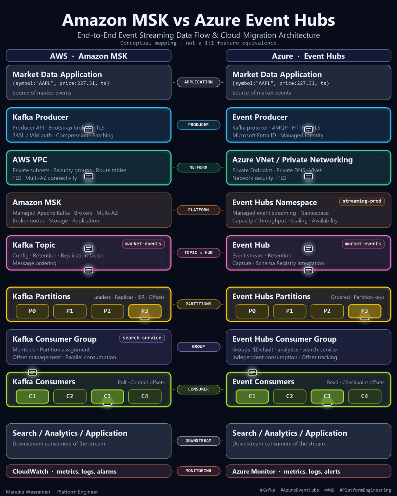
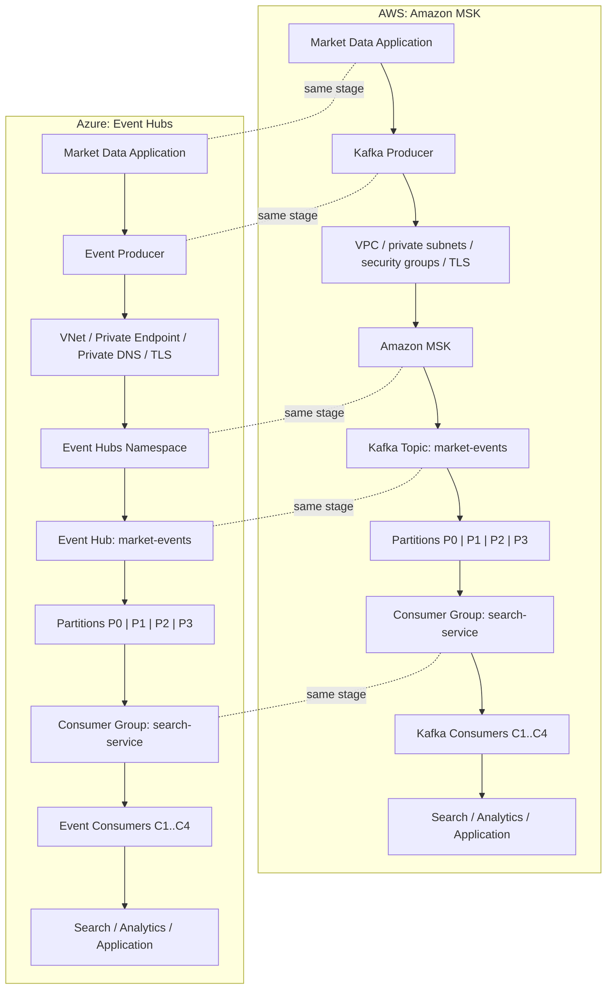
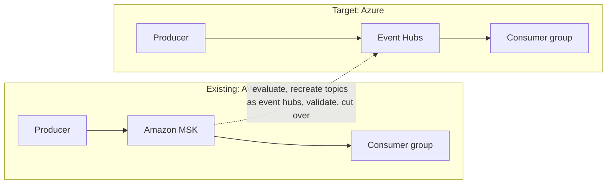

# Amazon MSK vs Azure Event Hubs

> A practical cloud streaming architecture reference comparing Amazon MSK / Apache Kafka with Azure Event Hubs, including data flow, partitioning, consumer groups, security, networking, observability, infrastructure as code, and AWS-to-Azure migration considerations.


## Project overview

This repository documents one event-streaming system on two clouds and gives you the code to run it on either.

- **Amazon MSK is managed Apache Kafka.** You get Kafka brokers, topics, partitions and replication, run for you.
- **Azure Event Hubs is a managed event streaming service** that also exposes a Kafka-compatible endpoint. It is not Kafka itself. Topics are event hubs, and several Kafka internals (such as replication and ISR) are managed by the service rather than exposed to you.

The same market-data flow is described, coded and deployed on both sides: a producer publishes `market-events`, the stream is split into four partitions keyed by `symbol`, and a consumer group named `search-service` reads them with one consumer per partition. Architecture, Python code, Terraform, diagrams and migration guidance all describe this one system.

> **Conceptual mapping, not exact 1:1 equivalence.** Concepts line up closely enough to compare, but the two services differ in operations, features, limits and pricing. See the [compatibility matrix](./migration/compatibility-matrix.md).

## 📌 Featured LinkedIn architecture visualization

This repository accompanies the LinkedIn post explaining the end-to-end architecture and data flow between Amazon MSK and Azure Event Hubs.

🔗 LinkedIn Post: [Add LinkedIn post URL here]

🎬 Architecture Visualization: [MSK vs Event Hubs animated GIF](./docs/images/msk-vs-event-hubs.gif)



The GIF lives in [`docs/images/`](./docs/images/README.md). Replace it there if you re-render the animation.

## 🔎 Explore the architecture

| Component | AWS | Azure |
| --- | --- | --- |
| Producer | [Kafka Producer](./producer/README.md) | [Event Producer](./producer/README.md) |
| Streaming Platform | [Amazon MSK](./docs/msk.md) | [Azure Event Hubs](./docs/azure-event-hubs.md) |
| Topics / Events | [Kafka Topics](./kafka/README.md) | [Event Hubs](./docs/azure-event-hubs.md) |
| Partitions | [Kafka Partitions](./docs/msk.md) | [Event Hubs Partitions](./docs/azure-event-hubs.md) |
| Consumer Groups | [Kafka Consumer Groups](./consumer/README.md) | [Event Hubs Consumer Groups](./consumer/README.md) |
| Networking | [AWS Networking](./aws/README.md) | [Azure Networking](./azure/README.md) |
| Security | [Security](./docs/security.md) | [Security](./docs/security.md) |
| Monitoring | [CloudWatch](./docs/observability.md) | [Azure Monitor](./docs/observability.md) |
| Migration | [Migration Guide](./migration/kafka-to-event-hubs.md) | [Migration Guide](./migration/kafka-to-event-hubs.md) |
| Infrastructure as code | [AWS Terraform](./aws/terraform/) | [Azure Terraform](./azure/terraform/) |

## Architecture at a glance



More diagrams are in [`diagrams/`](./diagrams/architecture.md). Start with [architecture](./docs/architecture.md) for the full explanation.

## End-to-end data flow

```text
Application -> Producer -> Network -> Streaming Platform -> Topic / Event Hub
            -> Partitions -> Consumer Group -> Consumer -> Downstream Application
```

| # | Stage | What happens |
| --- | --- | --- |
| 1 | Application | The market data application creates an event such as `{"symbol":"AAPL","price":227.31}` |
| 2 | Producer | The producer serializes the event and sends it with `symbol` as the partition key |
| 3 | Network | Traffic stays on private connectivity and is encrypted with TLS |
| 4 | Streaming platform | MSK brokers or the Event Hubs namespace receive and store the event |
| 5 | Topic / event hub | The event is appended to `market-events` |
| 6 | Partitions | The key hash selects one of four partitions, so events for one symbol stay in order |
| 7 | Consumer group | `search-service` divides the partitions between its members and tracks offsets |
| 8 | Consumer | Each consumer reads its partition and commits offsets after processing |
| 9 | Downstream | Search, analytics or another application uses the result |

The stage-by-stage walkthrough, with a sequence diagram, is in [data-flow](./docs/data-flow.md).

## AWS MSK architecture

Producers in a VPC connect over TLS with IAM authentication to MSK brokers in private subnets across availability zones. Security groups restrict the Kafka ports, and CloudWatch collects broker metrics and logs. Details: [Amazon MSK](./docs/msk.md), [AWS deployment](./aws/README.md), [diagram](./diagrams/msk-architecture.mermaid).

## Azure Event Hubs architecture

Producers in a VNet reach an Event Hubs namespace over a Private Endpoint, with a Private DNS zone resolving the namespace name to a private address. Authentication uses Microsoft Entra ID or SAS, and Azure Monitor collects metrics and logs. Details: [Azure Event Hubs](./docs/azure-event-hubs.md), [Azure deployment](./azure/README.md), [diagram](./diagrams/event-hubs-architecture.mermaid).

## Conceptual mapping

| Concept | Amazon MSK | Azure Event Hubs |
| --- | --- | --- |
| Producer | Kafka Producer | Event Producer |
| Streaming Platform | Amazon MSK | Event Hubs Namespace |
| Topic | Kafka Topic | Event Hub |
| Partition | Kafka Partition | Event Hubs Partition |
| Consumer Group | Kafka Consumer Group | Event Hubs Consumer Group |
| Consumer | Kafka Consumer | Event Consumer |
| Monitoring | CloudWatch | Azure Monitor |

These are conceptual mappings and not exact 1:1 equivalents.

## Technical comparison

| Area | Amazon MSK | Azure Event Hubs |
| --- | --- | --- |
| What it is | Managed Apache Kafka | Managed event streaming service with a Kafka-compatible endpoint |
| Kafka protocol | Native | Compatible interface |
| Stream name | Topic | Event hub |
| Replication | Kafka replication, ISR | Managed by the service |
| Client auth | TLS, SASL/IAM | TLS, Microsoft Entra ID, SAS |
| Private networking | VPC, security groups | VNet, Private Endpoint, Private DNS |
| Monitoring | CloudWatch | Azure Monitor |

Full comparison: [comparison](./docs/comparison.md).

## Security

AWS uses IAM, SASL/IAM, TLS, VPC and security groups. Azure uses Microsoft Entra ID, RBAC, Managed Identity, TLS, Private Endpoint and Private DNS. Both keep secrets out of code. See [security](./docs/security.md).

## Networking

Both sides keep brokers off the public internet and resolve names privately. See [networking](./docs/networking.md).

## Observability

CloudWatch on AWS and Azure Monitor with Log Analytics on Azure. Watch throughput, consumer lag, errors and storage. See [observability](./docs/observability.md) and [troubleshooting](./docs/troubleshooting.md).

## Migration architecture



What can stay unchanged, what needs configuration changes and what may need code changes is in the [migration guide](./migration/kafka-to-event-hubs.md). The migration folder index is [migration/README.md](./migration/README.md).

## Compatibility matrix

Event Hubs speaks the Kafka protocol, but it does not support every Kafka feature the same way. Check each feature you rely on against the [compatibility matrix](./migration/compatibility-matrix.md) and the current Microsoft documentation before you commit to a migration.

## Quick start

```bash
git clone <this repository>
cd msk-vs-azure-event-hubs
bash scripts/setup.sh            # creates .venv and installs dependencies
cp producer/config/config.example.yaml producer/config/config.yaml
cp consumer/config/config.example.yaml consumer/config/config.yaml
```

Pick a platform with `KAFKA_PLATFORM=msk` or `KAFKA_PLATFORM=eventhubs`, set the connection values described in [producer](./producer/README.md) and [consumer](./consumer/README.md), then check connectivity:

```bash
bash scripts/test-connectivity.sh
```

Never commit credentials. Config files with real values are ignored by [`.gitignore`](./.gitignore).

## AWS deployment

```bash
cd aws/terraform
cp terraform.tfvars.example terraform.tfvars   # edit placeholders
terraform init
terraform plan
```

Read [aws/README.md](./aws/README.md) first. Running `apply` creates billable resources in your account.

## Azure deployment

```bash
cd azure/terraform
cp terraform.tfvars.example terraform.tfvars   # edit placeholders
terraform init
terraform plan
```

Read [azure/README.md](./azure/README.md) first. Running `apply` creates billable resources in your subscription.

## Producer and consumer

The same Python code runs against both platforms. Only the connection settings change.

| Component | Purpose | Docs |
| --- | --- | --- |
| Producer | Publishes market-price events keyed by `symbol` | [producer/README.md](./producer/README.md) |
| Consumer | Reads as group `search-service`, commits offsets manually, shuts down cleanly | [consumer/README.md](./consumer/README.md) |
| Topic design | `market-events`, 4 partitions, 24 hour retention | [kafka/README.md](./kafka/README.md) |
| Event schema | JSON Schema for the event | [examples/event-schema.json](./examples/event-schema.json) |

## Production considerations

Partition strategy, consumer lag, retries, dead-letter handling, disaster recovery and more are in the [production checklist](./docs/production-checklist.md).

## Cost considerations

Cost drivers are described conceptually, with no prices. Use the current AWS and Azure pricing calculators for real numbers. See [cost considerations](./docs/cost-considerations.md).

## Engineering perspective

Choosing between MSK and Event Hubs is not simply "Kafka versus Event Hubs". A sound decision weighs:

- **Application ecosystem.** Which Kafka clients, connectors and stream-processing tools do you already depend on, and which Kafka features do they use?
- **Kafka feature requirements.** Compaction, transactions, Kafka Streams, admin APIs and partition changes can behave differently on the Kafka-compatible endpoint. Verify each one.
- **Operational model.** MSK gives you Kafka to operate (topics, partitions, client tuning, broker sizing). Event Hubs removes broker-level operations but also removes broker-level control.
- **Team expertise.** A team fluent in Kafka operations and a team fluent in Azure services will make different trade-offs.
- **Networking and authentication.** VPC and IAM versus VNet, Private Endpoint and Microsoft Entra ID shape how clients connect and how access is audited.
- **Throughput, retention and consumer patterns.** Sizing models differ, so test against your real load.
- **Monitoring.** Make sure you can see consumer lag and errors in the platform's native tooling.
- **Cost.** Compare with the current calculators, using your own workload numbers.
- **Migration complexity.** Count the producers, consumers and Kafka features involved before choosing a cut-over approach.
- **Cloud strategy.** A single-cloud commitment, a disaster-recovery region or a multi-cloud requirement may decide the question before the technical comparison does.

The [comparison](./docs/comparison.md) and [production checklist](./docs/production-checklist.md) turn these questions into concrete checks.

## Repository structure

```text
msk-vs-azure-event-hubs/
├── README.md
├── LICENSE
├── .gitignore
├── docs/                 architecture, data flow, MSK, Event Hubs, comparison,
│   │                     security, networking, observability, troubleshooting,
│   │                     cost, production checklist
│   └── images/           the LinkedIn GIF and poster
├── diagrams/             Mermaid sources for every diagram
├── producer/             Python producer (MSK or Event Hubs by configuration)
├── consumer/             Python consumer with a consumer group
├── kafka/                topic definition and client properties examples
├── aws/                  README and Terraform for VPC, security groups, MSK, CloudWatch
├── azure/                README and Terraform for Event Hubs, private networking, Azure Monitor
├── migration/            migration guide, architecture and compatibility matrix
├── scripts/              setup, cleanup and connectivity test
└── examples/             event schema and sample events
```

## References

- [Amazon MSK](https://docs.aws.amazon.com/msk/latest/developerguide/what-is-msk.html)
- [Apache Kafka documentation](https://kafka.apache.org/documentation/)
- [IAM access control for Amazon MSK](https://docs.aws.amazon.com/msk/latest/developerguide/iam-access-control.html)
- [Amazon CloudWatch](https://docs.aws.amazon.com/AmazonCloudWatch/latest/monitoring/WhatIsCloudWatch.html)
- [Azure Event Hubs](https://learn.microsoft.com/azure/event-hubs/event-hubs-about)
- [Event Hubs for Apache Kafka](https://learn.microsoft.com/azure/event-hubs/azure-event-hubs-apache-kafka-overview)
- [Microsoft Entra ID](https://learn.microsoft.com/entra/fundamentals/whatis)
- [Azure Private Endpoint](https://learn.microsoft.com/azure/private-link/private-endpoint-overview)
- [Azure Monitor](https://learn.microsoft.com/azure/azure-monitor/overview)
- [Terraform AWS provider](https://registry.terraform.io/providers/hashicorp/aws/latest/docs)
- [Terraform AzureRM provider](https://registry.terraform.io/providers/hashicorp/azurerm/latest/docs)

## License

Released under the [MIT License](./LICENSE).

---

Maintained by Manuka Weeraman, Platform Engineer.
