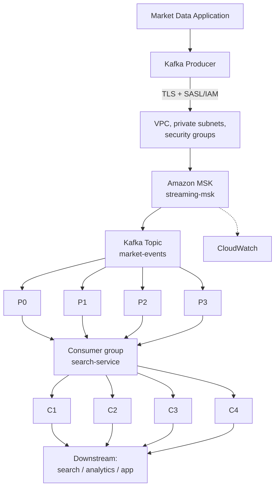
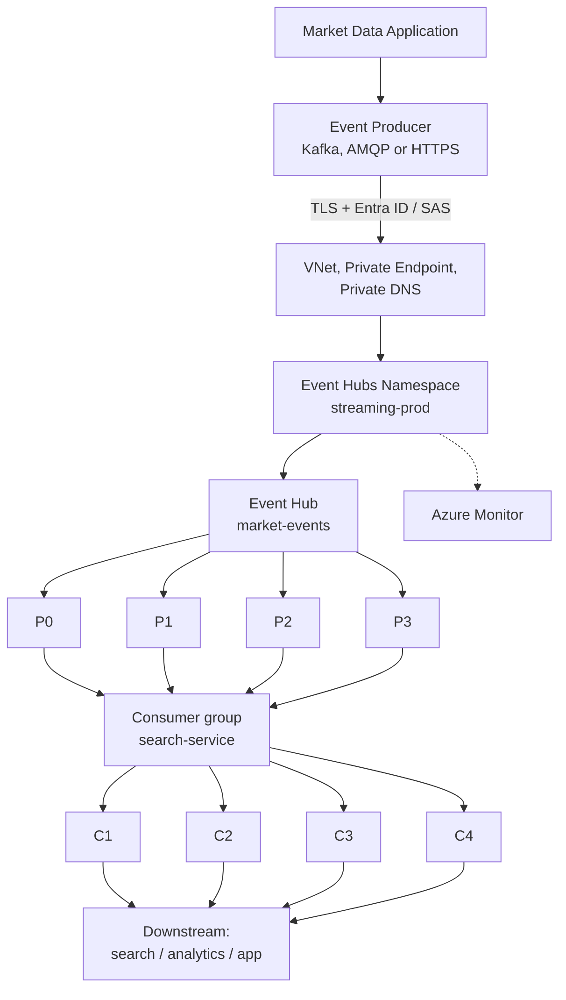
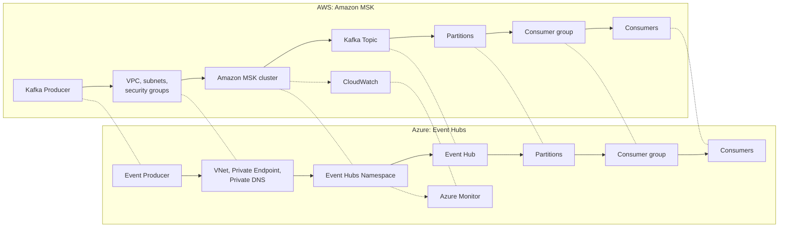
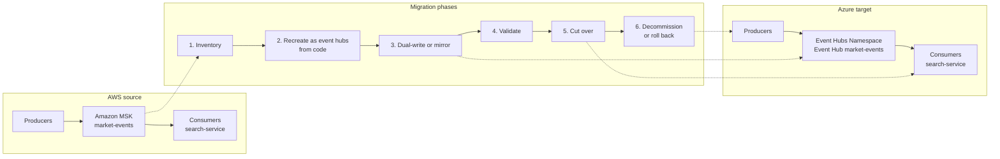

# Diagrams

All diagrams use the same nine-layer flow for the market-data pipeline: Application, Producer, Network/Security, Streaming platform, Topic / Event Hub, Partitions, Consumer group, Consumers, Downstream. The mapping between AWS and Azure components is conceptual, not 1:1. Each diagram is also available as a standalone `.mermaid` file in this folder.

## Amazon MSK architecture

The source flow on AWS: a Kafka producer reaches the `streaming-msk` cluster through VPC networking, writes to the `market-events` topic, and four consumers in the `search-service` group read one partition each. File: [msk-architecture.mermaid](./msk-architecture.mermaid).

## Azure Event Hubs architecture

The same flow on Azure: an event producer (Kafka protocol, AMQP or HTTPS) reaches the namespace through a Private Endpoint, writes to the `market-events` event hub, and consumers in the `search-service` group read the partitions. `streaming-prod` is a placeholder namespace name. File: [event-hubs-architecture.mermaid](./event-hubs-architecture.mermaid).

## MSK and Event Hubs side by side

Dotted lines link the nearest equivalent on each side. They show a conceptual mapping, not feature parity. File: [msk-vs-event-hubs.mermaid](./msk-vs-event-hubs.mermaid).

## Migration flow

An AWS source workload moves to an Azure target through six phases. Treat it as an evaluation path: each phase has a validation gate. File: [migration-flow.mermaid](./migration-flow.mermaid).

## See also

- [Architecture](../docs/architecture.md)
- [Data flow](../docs/data-flow.md)
- [MSK vs Event Hubs comparison](../docs/comparison.md)
- [Migration architecture](../migration/architecture.md)
- [Kafka to Event Hubs migration guide](../migration/kafka-to-event-hubs.md)
