# Architecture

This project describes one system on two clouds. A market-data application publishes price events. A streaming platform partitions them. A consumer group reads them and feeds search, analytics or another application. The logic is the same on AWS and Azure. The services and the network and security pieces differ.

The conceptual mapping between the two sides is a teaching aid, not an exact 1:1 equivalence. See [comparison](./comparison.md) for the differences.

## Side by side

```mermaid
flowchart TB
    subgraph AWS["AWS (us-east-1)"]
        direction LR
        A1["Market Data Application"] --> A2["Kafka Producer"]
        A2 --> A3["VPC, private subnets,<br/>security groups, TLS + SASL/IAM"]
        A3 --> A4["Amazon MSK<br/>streaming-msk"]
        A4 --> A5["Topic: market-events"]
        A5 --> A6["P0 P1 P2 P3"]
        A6 --> A7["Consumer group: search-service"]
        A7 --> A8["C1 C2 C3 C4"]
        A8 --> A9["Downstream"]
        A4 -.-> A10["CloudWatch"]
    end
    subgraph AZ["Azure (eastus)"]
        direction LR
        Z1["Market Data Application"] --> Z2["Event producer<br/>Kafka / AMQP / HTTPS"]
        Z2 --> Z3["VNet, Private Endpoint, Private DNS,<br/>TLS + Entra ID / SAS"]
        Z3 --> Z4["Event Hubs namespace<br/>streaming-prod"]
        Z4 --> Z5["Event hub: market-events"]
        Z5 --> Z6["P0 P1 P2 P3"]
        Z6 --> Z7["Consumer group: search-service"]
        Z7 --> Z8["C1 C2 C3 C4"]
        Z8 --> Z9["Downstream"]
        Z4 -.-> Z10["Azure Monitor"]
    end
```

## The nine layers

| # | Layer | AWS | Azure |
|---|---|---|---|
| 1 | Application | Market Data Application | Market Data Application |
| 2 | Producer | Kafka producer | Event producer (Kafka protocol, AMQP or HTTPS) |
| 3 | Network and security | VPC, private subnets, security groups, TLS, SASL/IAM | VNet, Private Endpoint, Private DNS, TLS, Microsoft Entra ID or SAS |
| 4 | Streaming platform | Amazon MSK (`streaming-msk`) | Event Hubs namespace (`streaming-prod`) |
| 5 | Stream | Kafka topic `market-events` | Event hub `market-events` |
| 6 | Partitions | P0 to P3 | P0 to P3 |
| 7 | Consumer group | `search-service` | `search-service` (also `analytics`, `$Default`) |
| 8 | Consumers | C1 to C4, one per partition | C1 to C4, one per partition |
| 9 | Downstream | Search, analytics, application | Search, analytics, application |

Monitoring runs alongside: CloudWatch on AWS, Azure Monitor on Azure.

## How the repo fits

| Path | Role |
|---|---|
| `producer/` | A producer that sends `market-events` records keyed by `symbol`. Configured for either cloud. |
| `consumer/` | A consumer that joins the `search-service` group and reads its assigned partitions. |
| `kafka/` | The topic definition and Kafka client properties shared by both clouds. |
| `aws/` | Terraform for the VPC, MSK cluster and CloudWatch monitoring. |
| `azure/` | Terraform for the VNet, Event Hubs namespace, event hub, Private Endpoint and Azure Monitor. |
| `migration/` | Notes on moving a Kafka workload to Event Hubs and what to verify. |

The producer and consumer use the Kafka protocol on both sides. Only the connection and authentication settings change between clouds. That is the point of the Kafka-compatible endpoint, with the caveats listed in [Azure Event Hubs](./azure-event-hubs.md).

## See also

- [Data flow](./data-flow.md)
- [Amazon MSK](./msk.md)
- [Azure Event Hubs](./azure-event-hubs.md)
- [Comparison](./comparison.md)
- [Migration guide](../migration/README.md)
