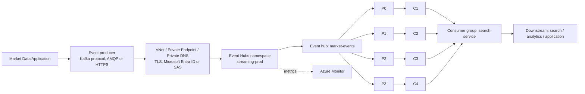

# Azure Event Hubs

Azure Event Hubs is a managed event streaming service. Producers send events over a protocol, and consumer groups read them from partitions. It also exposes a Kafka-compatible endpoint, so Kafka clients can talk to it with mostly configuration changes. It is not Apache Kafka itself, and it does not expose every Kafka feature. Official overview: [Azure Event Hubs](https://learn.microsoft.com/azure/event-hubs/event-hubs-about).

This page uses the namespace `streaming-prod` (a placeholder: real namespace names are globally unique, so pick your own), in `eastus`, with the event hub `market-events` (4 partitions, key = `symbol`, 1 day retention) and the consumer groups `search-service`, `analytics` and `$Default`.

## Concepts

| Concept | What it is |
|---|---|
| Namespace | The container and endpoint for one or more event hubs. Networking, tier and capacity settings apply here. Example: `streaming-prod`. |
| Event hub | The named stream inside a namespace. Equivalent in role to a Kafka topic. Example: `market-events`. |
| Partition | An ordered sequence of events. Events with the same partition key go to the same partition. Count is set per event hub. |
| Consumer group | An independent view of the event hub. Each group tracks its own position. Within a group, a partition is read by one consumer at a time. `$Default` always exists. |
| Producer | Any client that sends events: Kafka protocol, AMQP or HTTPS. |
| Consumer | A client that reads events from partitions as part of a consumer group. |
| Retention | How long events are kept. The allowed range depends on tier. Check the current documentation. |

## Protocols

Event Hubs accepts events over three protocols:

- Kafka protocol, through the Kafka-compatible endpoint. See [Event Hubs for Apache Kafka](https://learn.microsoft.com/azure/event-hubs/azure-event-hubs-apache-kafka-overview).
- AMQP, used by the native Azure SDKs.
- HTTPS, for simple senders.

## Native Kafka versus the Kafka-compatible endpoint

Real Kafka runs brokers that you (or MSK) configure. Event Hubs implements the Kafka wire protocol in front of its own engine. The result is compatible for common producer and consumer use, but the two are not identical.

| Topic | Apache Kafka / MSK | Event Hubs Kafka endpoint |
|---|---|---|
| Naming | Topic | Event hub (a Kafka topic maps to an event hub in the namespace) |
| Cluster | A cluster of brokers you can inspect | A namespace; brokers are not exposed |
| Replication, ISR | Configurable per topic (replication factor, `min.insync.replicas`) | Handled by the service; these knobs are not exposed |
| Broker configuration | Broker and topic configs under your control | Broker-level configs are not user-managed; only supported topic-level settings apply |
| Admin operations | Full Kafka Admin API against the brokers | Partly supported; creating event hubs is typically done through Azure (ARM, Terraform, portal) |
| Tier | Not applicable | The Kafka endpoint requires Standard tier or above. Verify in current docs. |
| Auth | TLS, SASL (SCRAM, IAM on MSK, mTLS) | TLS with SASL, using a connection string (SAS) or Microsoft Entra ID (OAuth) |
| Advanced features | Transactions, Kafka Streams, log compaction, and others as per the Kafka version | Support for some of these features depends on tier and service version. Verify in current Microsoft docs before depending on them. |

Practical guidance: test your real client code, including consumer group rebalancing, offset commits and any admin calls, against Event Hubs before committing to a migration. The [compatibility matrix](../migration/compatibility-matrix.md) tracks the details used in this repo.

## Security and identity

- Microsoft Entra ID authenticates identities. RBAC roles (for example data sender and data receiver roles) grant access at the namespace or event hub scope. See [Microsoft Entra ID](https://learn.microsoft.com/entra/fundamentals/whatis).
- Managed Identity lets an Azure workload authenticate without storing a secret.
- SAS keys and connection strings also work but are secrets. Prefer Entra ID where your clients support it, and never commit connection strings.
- TLS protects traffic in transit.

## Networking

- A Private Endpoint gives the namespace a private IP in your VNet. See [Azure Private Endpoint](https://learn.microsoft.com/azure/private-link/private-endpoint-overview).
- A Private DNS zone makes the namespace hostname resolve to that private address from inside the VNet.
- Public network access can then be disabled. Details in [networking](./networking.md).

## Monitoring, retention and related features

- Azure Monitor collects metrics and diagnostic logs. See [Azure Monitor](https://learn.microsoft.com/azure/azure-monitor/overview).
- Capture can write events automatically to Azure Storage (Blob or Data Lake) for long term retention and batch analysis. Availability depends on tier.
- Schema Registry stores and versions schemas for event payloads. Availability depends on tier.
- Retention in the event hub is bounded and tier dependent. Use Capture or a downstream store for anything longer.

## Scaling and capacity

Scale in Event Hubs is expressed in tier-specific capacity units (throughput units, processing units or capacity units, depending on tier), not in broker counts. Partition count sets the maximum consumer parallelism in a group and, on some tiers, can only be changed in limited ways after creation. Tiers, units, limits and any auto-inflate behaviour change over time. Check the current documentation instead of relying on numbers here.

## Azure flow

## In this repo

Terraform for the namespace, event hub, networking and monitoring: [azure/README.md](../azure/README.md).

## See also

- [Amazon MSK](./msk.md)
- [MSK vs Event Hubs comparison](./comparison.md)
- [Kafka to Event Hubs migration](../migration/kafka-to-event-hubs.md)
- [Compatibility matrix](../migration/compatibility-matrix.md)
- [Azure Terraform guide](../azure/README.md)
