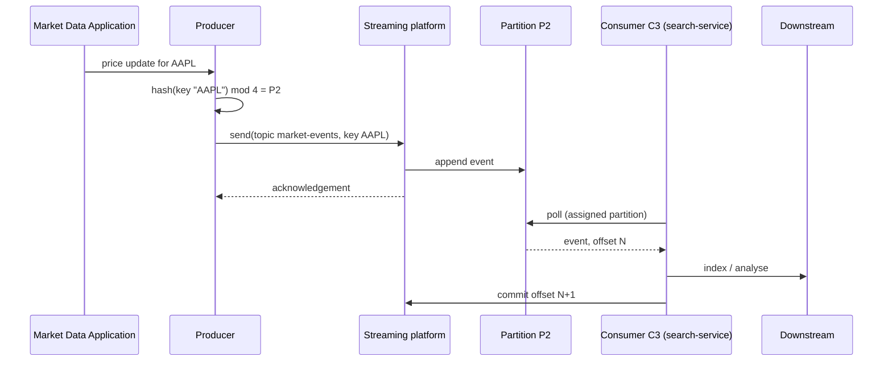

# Data flow

This page follows one event through the nine stages on each cloud. The event:

```json
{"event_type":"market-price","symbol":"AAPL","price":227.31,"timestamp":"2026-10-05T08:00:00Z"}
```

## Stages

| # | Stage | AWS (MSK) | Azure (Event Hubs) |
|---|---|---|---|
| 1 | Application | The app produces a price update for `AAPL`. | Same. |
| 2 | Producer | A Kafka producer serialises the event and sets the record key to `symbol` (`AAPL`). | An event producer does the same, over the Kafka protocol, AMQP or HTTPS. |
| 3 | Network and security | The producer connects from inside the VPC. Security groups allow the broker port. TLS encrypts the link and SASL/IAM authenticates. | The producer resolves the namespace name through Private DNS to a Private Endpoint in the VNet. TLS encrypts the link. Microsoft Entra ID (or SAS) authenticates. |
| 4 | Streaming platform | The `streaming-msk` brokers receive the record. | The `streaming-prod` namespace receives it. |
| 5 | Stream | The record is appended to topic `market-events`. | The record is appended to event hub `market-events`. |
| 6 | Partition | The key hash selects one of P0 to P3. All `AAPL` events go to the same partition. | Same behaviour: the partition key selects one of P0 to P3. |
| 7 | Consumer group | `search-service` tracks its offset per partition. | `search-service` tracks its position per partition. Other groups (`analytics`, `$Default`) read independently. |
| 8 | Consumer | One consumer (C1 to C4) owns the partition and reads the event. | Same. |
| 9 | Downstream | Search, analytics or an application uses the event. | Same. |

Monitoring (CloudWatch or Azure Monitor) observes stages 4 to 8: throughput, errors and consumer lag.

## Routing the AAPL event

The producer hashes the key `AAPL` and takes it modulo the partition count (4). The result is a fixed partition, for example P2. Every later `AAPL` event goes to P2, so per-symbol order is preserved. Order across different symbols is not guaranteed, because they may sit in different partitions.

In the group `search-service`, partition P2 is assigned to exactly one consumer, say C3. No other consumer in that group sees the event. A different group, such as `analytics` on Azure, keeps its own position and also receives the event.

If the partition count changes, the hash-to-partition mapping changes too. Pick the count up front.



The partition number P2 is illustrative. The real value depends on the hash function of the client library.

## Conceptual mapping

| Concept | Amazon MSK | Azure Event Hubs |
|---|---|---|
| Producer | Kafka producer | Event producer (Kafka protocol, AMQP or HTTPS) |
| Streaming platform | Amazon MSK | Event Hubs namespace |
| Topic | Kafka topic | Event hub |
| Partition | Partition | Partition |
| Consumer group | Consumer group | Consumer group |
| Consumer | Consumer | Consumer |
| Monitoring | CloudWatch | Azure Monitor |

These are conceptual mappings, not exact 1:1 equivalents. Replication, broker configuration and some advanced features differ. See [comparison](./comparison.md).

## See also

- [Architecture](./architecture.md)
- [Amazon MSK](./msk.md)
- [Azure Event Hubs](./azure-event-hubs.md)
- [Comparison](./comparison.md)
- [Producer](../producer/README.md)
