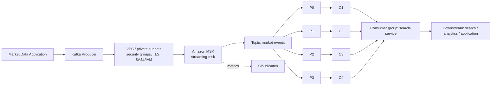

# Amazon MSK

Amazon MSK (Managed Streaming for Apache Kafka) is managed Apache Kafka on AWS. AWS runs the brokers and the cluster control plane. You use the standard Kafka protocol and the standard Kafka client libraries. Official overview: [What is Amazon MSK](https://docs.aws.amazon.com/msk/latest/developerguide/what-is-msk.html).

This page uses the example cluster `streaming-msk` in `us-east-1`, with the topic `market-events` (4 partitions, key = `symbol`, 24 hour retention) and the consumer group `search-service`.

## Kafka concepts

| Concept | What it is |
|---|---|
| Broker | A Kafka server that stores partitions and serves producers and consumers. A cluster has several brokers. |
| Topic | A named, append-only stream of events. Here: `market-events`. |
| Partition | An ordered log that is a slice of a topic. Ordering is guaranteed only inside one partition. |
| Replication | Each partition is copied to several brokers. One replica is the leader, the others are followers. |
| ISR | In-sync replicas: the followers that are caught up with the leader. A write with `acks=all` is acknowledged once the ISR has it, subject to `min.insync.replicas`. |
| Producer | A client that writes events to a topic. It picks the partition from the record key (hash of the key) unless told otherwise. |
| Consumer | A client that reads events from partitions. |
| Consumer group | A set of consumers that share a topic. Each partition is read by at most one consumer in the group at a time. |
| Offset | The position of a record in a partition. Consumer groups commit offsets so they can resume. |
| Retention | How long (or how much) data Kafka keeps, set per topic. Reading does not delete data. |
| Bootstrap brokers | The initial broker addresses a client connects to. The client then discovers the rest of the cluster from them. |

Full reference: [Apache Kafka documentation](https://kafka.apache.org/documentation/).

## How MSK is laid out

- Brokers run in private subnets of your VPC, normally spread across three Availability Zones (Multi-AZ). Partition replicas are placed on brokers in different AZs, so losing one AZ does not lose the data when replication is configured sensibly.
- Clients reach the brokers through the VPC. Access is controlled with security groups, for example allowing the Kafka listener port only from the producer and consumer security groups.
- Authentication is configured per cluster. Common options are TLS client auth and SASL (including SASL/IAM, which uses AWS IAM policies for Kafka actions). See [MSK IAM access control](https://docs.aws.amazon.com/msk/latest/developerguide/iam-access-control.html). Encryption in transit uses TLS.
- Metrics go to Amazon CloudWatch. Broker logs can be delivered to CloudWatch Logs, S3 or Firehose. See [Amazon CloudWatch](https://docs.aws.amazon.com/AmazonCloudWatch/latest/monitoring/WhatIsCloudWatch.html).
- Cluster types and sizing options (provisioned, serverless, instance families, storage) change over time. Check the current MSK documentation instead of relying on this page.

## MSK flow

## What the managed service does for you

| AWS handles | You still own |
|---|---|
| Provisioning brokers and the underlying infrastructure | Choosing cluster size and storage, and revisiting it as load grows |
| Replacing failed brokers, patching the broker software within the service's maintenance model | Topic design: names, partition count, replication factor, retention, `min.insync.replicas` |
| Multi-AZ placement of brokers | Partition key choice (a skewed key creates hot partitions) |
| Integration with IAM, KMS, VPC and CloudWatch | Client configuration: `acks`, retries, idempotence, batching, offset commit strategy |
| Metrics and optional log delivery | Consumer lag monitoring and alerting, and scaling consumers |
| Encryption at rest and in transit options | Security groups, auth mode, IAM policies, and who may create topics |

Increasing partitions later changes which partition a given key maps to, so plan the count up front.

## In this repo

- Terraform for the cluster, networking and monitoring: [aws/README.md](../aws/README.md)
- Topic definition and client properties: [kafka/README.md](../kafka/README.md)

## See also

- [Azure Event Hubs](./azure-event-hubs.md)
- [MSK vs Event Hubs comparison](./comparison.md)
- [Data flow](./data-flow.md)
- [Security](./security.md)
- [AWS Terraform guide](../aws/README.md)
