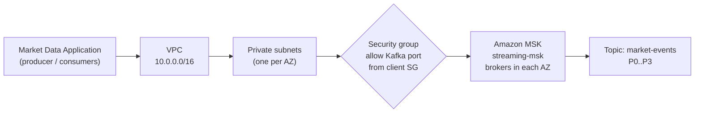
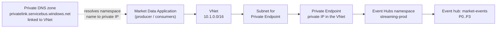

# Networking: private connectivity on AWS and Azure

The goal on both clouds is the same: the Market Data Application and its consumers reach the streaming platform over private addresses, and the platform is not reachable from the public internet. The mechanisms differ. The comparison is conceptual, not 1:1.

## AWS path

Application -> VPC -> private subnet -> security group -> Amazon MSK

How it works:

- The MSK brokers are placed in private subnets of your VPC. Each broker has a private IP address in its subnet.
- Clients in the same VPC (or a connected network) resolve the broker DNS names to those private addresses.
- Security groups are stateful allow-lists. The cluster security group should allow the Kafka listener port only from the client security group.
- Clients outside the VPC need a connected network, such as VPC peering, Transit Gateway, VPN or Direct Connect. MSK also has a multi-VPC private connectivity feature. Check the [MSK docs](https://docs.aws.amazon.com/msk/latest/developerguide/what-is-msk.html) for the current options and their limits.
- The Kafka client bootstraps from a list of broker addresses, then connects to each broker that leads a partition. Every broker address must be reachable, not just the first.

## Azure path

Application -> VNet -> Private Endpoint -> Private DNS -> Event Hubs

How it works:

- A Private Endpoint creates a network interface with a private IP in a subnet of your VNet. It maps to the Event Hubs namespace through Azure Private Link. See [Azure Private Endpoint](https://learn.microsoft.com/azure/private-link/private-endpoint-overview).
- The client still uses the namespace's normal name, for example `streaming-prod.servicebus.windows.net`. The namespace name is a placeholder: real namespace names are globally unique.
- The public name is a CNAME to a `privatelink` name. A private DNS zone linked to the VNet answers that name with the private IP. Without the zone, or without the link, the client gets the public address instead.
- Once private access works, disable public network access on the namespace so the public path is closed, not just unused.
- Private Endpoint availability depends on the Event Hubs tier. Verify in the [Event Hubs docs](https://learn.microsoft.com/azure/event-hubs/event-hubs-about).

## DNS resolution explained

The two-step resolution on Azure is where most private-connectivity problems occur.

1. The application resolves `<namespace>.servicebus.windows.net`.
2. Public DNS returns a CNAME to `<namespace>.privatelink.servicebus.windows.net`.
3. If the VNet is linked to the private DNS zone `privatelink.servicebus.windows.net`, that name resolves to the Private Endpoint's private IP (for example 10.1.2.4).
4. If it is not, public resolution continues and returns a public IP.

Callers in other networks (on-premises, peered VNets, another cloud) need a DNS path to that zone too. Typical approaches are a DNS forwarder or Azure DNS Private Resolver. Treat this as a design item and verify with `nslookup` from each client network.

On AWS, MSK broker names resolve to private IPs from within the VPC. Clients elsewhere need DNS that can resolve those names, which depends on how the networks are connected. Verify from each client network.

## Common failure modes

| Failure | Platform | What you see | Where to look |
| --- | --- | --- | --- |
| Private DNS zone not linked to the client VNet | Azure | Namespace resolves to a public IP; connection blocked or goes via public path | `nslookup`, zone's virtual network links |
| Public access disabled but client resolves public IP | Azure | Connection refused or forbidden | DNS first, then namespace network settings |
| Missing or wrong DNS forwarding from on-premises | Both | Name does not resolve, or resolves to the wrong address | Resolver config, conditional forwarders |
| NSG or route rules block the Private Endpoint subnet | Azure | Timeouts | Effective routes and NSG rules |
| Security group does not allow the client | AWS | Timeouts on connect | Cluster SG inbound rules, client SG |
| Client reaches the first broker but not the others | AWS | Metadata fetch works, produce or fetch times out | Reachability and SG rules to every broker |
| Wrong listener port for the auth mode | AWS | Connect resets or handshake errors | MSK bootstrap string for the chosen auth |
| Wrong port or protocol | Azure | Handshake errors | Kafka endpoint port per the Event Hubs Kafka docs |
| Subnet or CIDR overlap between networks | Both | Unreachable or misrouted traffic | Address plans |

Commands for diagnosing these are in [Troubleshooting](./troubleshooting.md).

## Cross-cloud connectivity during a migration

During a migration from MSK to Event Hubs (see the [migration guide](../migration/kafka-to-event-hubs.md)) some component usually runs in one cloud while the platform lives in the other. For example, a consumer still in AWS reading from Event Hubs, or a mirroring process copying events across. Keep this conceptual and verify each point for your environment.

- Decide the path: public internet with strict controls, or private (site-to-site VPN or dedicated circuits between the clouds). Private is the production default, but it adds design and operational work.
- Plan non-overlapping address ranges across the VPC and VNet before connecting them.
- Plan DNS in both directions. The Private DNS zone for Event Hubs must be resolvable from wherever the client runs.
- Understand the cost of cross-cloud data transfer. See [Cost considerations](./cost-considerations.md).
- Expect added latency. Check producer timeouts, consumer session timeouts and batch settings against the real round-trip time.
- Define who authenticates how. An AWS workload calling Event Hubs needs an Entra identity or a SAS credential, and the secret handling must be agreed in advance.
- If you run the migration with a replication tool, verify its network and authentication requirements in its own documentation.

What to verify before cutover: DNS answers from every client network, reachability on the correct ports, the auth path for each cross-cloud client, and observed latency under load.

## See also

- [Security](./security.md)
- [Troubleshooting](./troubleshooting.md)
- [Architecture](./architecture.md)
- [Kafka to Event Hubs migration](../migration/kafka-to-event-hubs.md)
- [Terraform for Azure](../azure/README.md)
