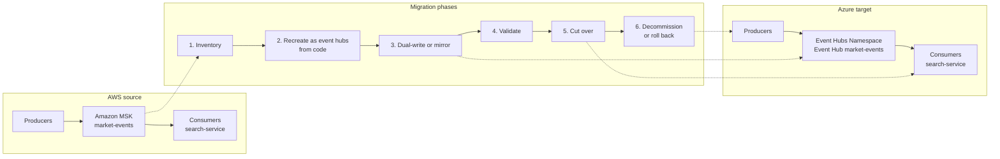

# Migration architecture

This page describes the systems involved when you evaluate moving the `market-events` workload from Amazon MSK to Azure Event Hubs. The component mapping is conceptual, not 1:1.

## Current state

Market Data Application -> Kafka producer -> Amazon MSK (`streaming-msk`) -> topic `market-events` -> 4 partitions -> consumer group `search-service` -> consumers C1..C4 -> downstream search, analytics or applications. Network access is through a VPC, private subnets and security groups. Authentication is TLS with SASL (for example IAM). Metrics go to CloudWatch.

## Target state

Market Data Application -> producer -> Event Hubs namespace (`streaming-prod`) -> event hub `market-events` -> 4 partitions -> consumer group `search-service` -> consumers C1..C4 -> the same downstream systems. Network access is through a VNet, a Private Endpoint and Private DNS. Authentication is TLS with Microsoft Entra ID or SAS. Metrics go to Azure Monitor. The producer can keep using the Kafka protocol if the Kafka endpoint of your tier meets your needs, or move to the Event Hubs SDK (AMQP or HTTPS).

## What happens during the migration

- Both platforms run in parallel. The source is not changed until cut-over.
- Data reaches the target by dual-write from producers or by a replication process that copies records from MSK to Event Hubs. Replication tooling must be checked against current documentation before you rely on it.
- Consumers on the target start with their own consumer group and their own offsets. Offsets are not shared between platforms, so plan how consumers resume (from a timestamp, from the earliest retained record, or from a known business marker).
- A cross-cloud network path (VPN or similar) is needed if the replication process runs across clouds. Design and secure it separately.
- Cut-over order (consumers first or producers first) is a decision with trade-offs. See [the migration guide](./kafka-to-event-hubs.md#phased-plan).

## See also

- [Kafka to Event Hubs migration guide](./kafka-to-event-hubs.md)
- [Compatibility matrix](./compatibility-matrix.md)
- [Diagrams](../diagrams/architecture.md)
- [Networking](../docs/networking.md)
- [Data flow](../docs/data-flow.md)
